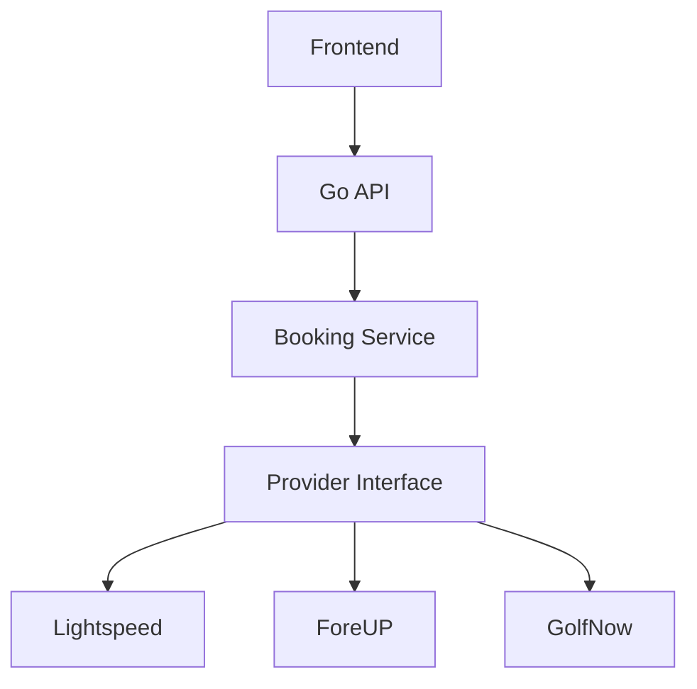
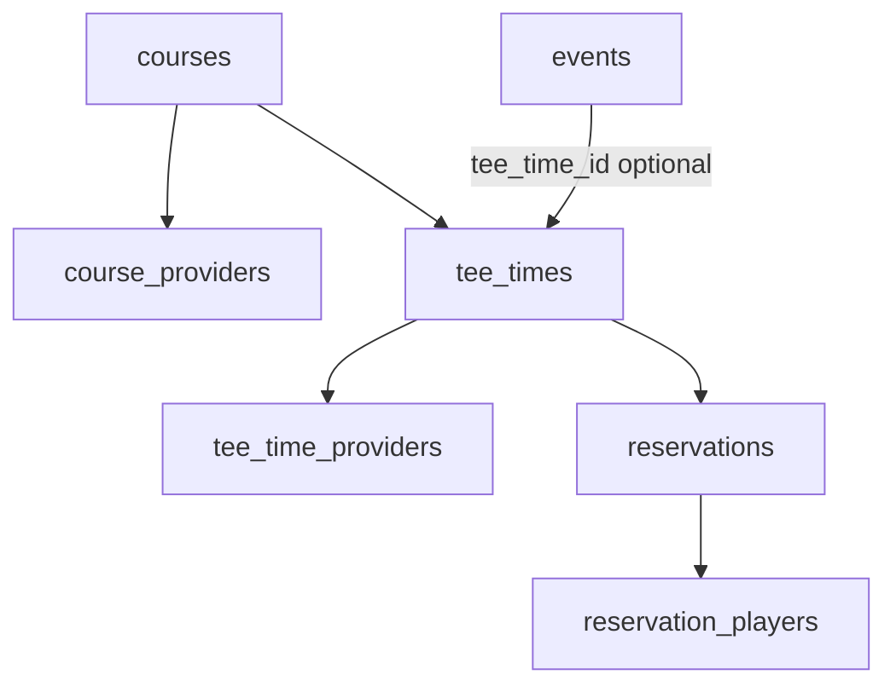
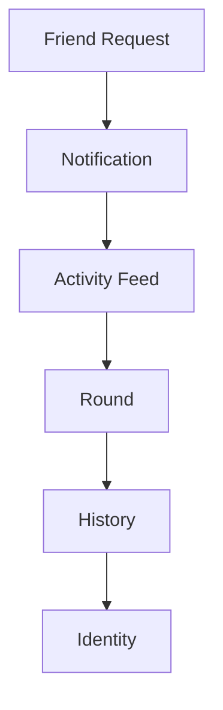

# FindFore — Architecture

**Last Updated:** August 12, 2026  
**Status:** Living document — system shape, boundaries, and diagrams.

> **Product direction:** [`VISION.md`](./VISION.md)  
> **Day-to-day engineering rules:** [`CLAUDE.md`](./CLAUDE.md)

---

## Guiding Principles

**Principle 1 — Optimize for deleting code.**  
The best feature is the one you never had to write.

**Principle 2 — Every external service gets an adapter.**  
Today that includes Lightspeed, Google Maps, Google Auth, Stripe, SendGrid, and push notifications. Tomorrow you can swap providers without rewriting business logic.

**Principle 3 — Business logic owns the truth.**  
Never let SQL, React, or external APIs make business decisions.

**Principle 4 — Everything is observable.**  
Every important action should answer: Who? What? When? How long? Did it succeed?

Apply Hexagonal Architecture at **system boundaries** (database, booking providers, notifications, payments, storage, maps, external APIs). Avoid unnecessary abstractions inside simple domain code.

---

## Booking Provider Stack

Booking is infrastructure behind a stable interface. The frontend and domain never talk to a tee-sheet vendor directly — they go through the Go API and a booking service that depends on a provider port.

```text
Frontend
   ↓
Go API
   ↓
Booking Service
   ↓
Provider Interface
   ↓
┌──────────┬──────────┬──────────┐
│Lightspeed│  ForeUP  │ GolfNow  │
└──────────┴──────────┴──────────┘
```



| Layer | Responsibility |
|---|---|
| Frontend | UX for discovery, invites, and booking flows — no vendor-specific logic |
| Go API | HTTP authz, request validation, response mapping |
| Booking Service | Domain rules for availability, holds, invites, and booking state |
| Provider Interface | Port that booking adapters implement |
| Lightspeed / ForeUP / GolfNow | Concrete adapters; swappable without changing the service |

### Social events vs booking inventory (today)

```text
courses
  ├── course_providers
  ├── events  → tee_time_id? → tee_times
  └── tee_times
```

- Provider owns real tee-sheet inventory; FindFore stores a **normalized representation/cache**.
- Association is always `event → tee_time` (nullable), never the reverse.
- Join/accept capacity uses `SELECT … FOR UPDATE`; `UNIQUE (player_id, event_id)` is the membership safety net.
- Production migrations must not silently delete user data without an explicit, reviewed data-migration strategy.

See **Booking domain model** below. Schema: `tee_time_providers`, reservation tables, `events.planned_starts_at` (`000009`–`000011`), hardening fields (`000012`: `provider_request_id`, quoted price, `last_synced_at`), and HTTP client idempotency (`000013`: `client_idempotency_key`).

---

## Booking domain model

**Status:** HTTP booking API shipped (provider-agnostic; fake-provider HTTP tests green). Live Lightspeed mapping remains deferred — review HTTP layer before wiring.

**Locked decisions**

| Decision | Choice |
|---|---|
| Event time | **Option B:** `planned_starts_at` + optional `tee_time_id` — semantically distinct; no DB equality constraint |
| Domain | Provider-agnostic entities and state machines |
| First walkthrough | Lightspeed as concrete pressure-test; every step must still work for ForeUP (else push into the adapter) |
| Party booking | `reservations` + `reservation_players`; event ≠ reservation |
| Tee time status | FindFore **local knowledge** of the slot — not authoritative provider state |
| Money | Tee time caches display price; reservation stores **quoted** price at begin |
| Idempotency | Client `Idempotency-Key` → reservation row; FindFore-generated `provider_request_id` persisted before provider call; retries reuse it |
| HTTP surface | FindFore IDs only (`course_id`, `tee_time_id`, `reservation_id`); never expose provider/external fields |
| AuthZ | Only `booked_by_player_id` may confirm/cancel; enforced in the booking service |



```text
                 FindFore domain
                       │
                 ┌─────┴─────┐
                 │           │
              TeeTime    Reservation
                 │           │
                 └─────┬─────┘
                       │
                 Provider identity
                       │
              ┌────────┴────────┐
              │                 │
          Lightspeed          ForeUP
```

### Principles

1. **`tee_times.status` is FindFore’s local knowledge**, not provider authority. Provider rejection → mark reservation `failed` and refresh cache from the provider; never invent `booked` without confirmation. Provider sync may overwrite cached status/slots.
2. **Money:** tee time keeps cached `price_cents`/`currency` for display; reservation stores `quoted_price_cents`/`quoted_currency` at begin (what the user agreed to).
3. **Cache freshness:** `tee_times.last_synced_at` is set on every successful provider search/upsert. Search responses include `source` (`provider` \| `cache`) and `fetched_at`. On provider failure, return cached rows when present (`source=cache`); never treat cache as a booking guarantee.
4. **Idempotency:** Two layers:
   - **Client:** HTTP `Idempotency-Key` (required on `POST /reservations`) maps to `reservations.client_idempotency_key` with `UNIQUE(booked_by_player_id, key)`. Repeat POSTs return the same reservation and may resume Hold.
   - **Provider:** FindFore generates and persists `provider_request_id` **before** the provider call. Hold/Confirm send that UUID as `IdempotencyKey`. Cancel uses `{uuid}:cancel` in the adapter request only. Never accept `provider_request_id` from the client. In-flight `pending`/`held` resumes **re-invoke** the provider with the same key. Known failure → `failed` + new row on next attempt. Unknown outcome (timeout) → leave `pending`/`held`, return `ErrProviderOutcomeUnknown`, retry same reservation (same client key). If a vendor lacks native idempotency headers, reconciliation stays in the adapter; domain only passes the key.

### Entities

| Entity | Owns | Does not own |
|---|---|---|
| `courses` | Place + IANA timezone (long-term NOT NULL) | Vendor IDs |
| `course_providers` | Immutable `(provider, external_id) → course` | Tee sheet |
| `tee_times` | FindFore slot: `course_id`, `starts_at`, cached holes/capacity/slots/price, `last_synced_at` | Vendor slot id |
| `tee_time_providers` | Immutable `(provider, external_id) → tee_time` | Social invites |
| `reservations` | Party booking lifecycle, `client_idempotency_key`, `provider_request_id`, quoted price | Feed / friends |
| `reservation_players` | Party members (`player_id` and/or `guest_name`; both allowed — name for provider, id for FindFore) | Provider payload |
| `events` | Social round: `planned_starts_at`, optional `tee_time_id` | Inventory / payment |

**Association rules**

- Event and reservation are **siblings** under a tee time, not the same row.
- Many reservation attempts over time; at most one **non-terminal** (`pending` / `held` / `confirmed`) per tee time — enforced by partial unique `uq_reservations_active_tee_time` (`000010`).
- Planned vs tee-time instants may diverge (planned 8:00, selected 8:20). UX may warn; the DB must not reject.

**Schema notes**

- `tee_times` — cached `capacity`, `available_slots`, `price_cents`, `currency`, `last_synced_at`; status `available \| held \| booked \| cancelled` (local knowledge).
- `tee_time_providers` — `UNIQUE(provider, external_id)`, immutable reassignment (same as `course_providers`).
- `reservations` — `client_idempotency_key` + partial unique `(booked_by_player_id, key)` (`000013`); `provider_request_id` + `UNIQUE(provider, provider_request_id)`; `quoted_price_cents` / `quoted_currency`; partial unique on active statuses per tee time.
- `reservation_players` — at least one of `player_id` / non-empty `guest_name` (`000010`).
- `events.planned_starts_at` — display play time = linked `tee_times.starts_at` if present, else planned.

### State machines

**TeeTime** (FindFore knowledge)

```text
available ──hold/book──► held ──confirm──► booked
    │                      │
    │                      └──expire/fail──► available
    └──sync cancel────────► cancelled
```

**Reservation**

```text
pending ──► held ──► confirmed
   │          │          │
   │          │          └──► cancelled
   │          └──expire/fail──► failed
   └──fail──► failed
```

Terminal: `cancelled`, `failed`, and `confirmed` until cancel. After fail/cancel, retry creates a **new** reservation row (unless resuming the same `pending`/`held`).

All status mutations go through `entity.CanTransitionReservation` / `TransitionReservation` (illegal edges rejected before persist).

### HTTP booking API

Authenticated (`/api/v1`):

| Method | Path | Notes |
|---|---|---|
| `GET` | `/courses/{courseID}/tee-times?from=&to=&players=` | Begin search attempt: provider fetch + cache upsert when possible. Response includes `tee_times`, `source` (`provider`\|`cache`), `fetched_at`. `?players=N` is a **best-effort** filter on cached/provider `available_slots >= N` — not a hold. Windows: `from < to`, max 90 days long, `to` ≤ 90 days ahead. Cached rows are never a booking guarantee. |
| `POST` | `/reservations` | **Begin a booking attempt** (may land `pending`/`held`/`confirmed` depending on provider) — not “tee time is confirmed.” Requires `Idempotency-Key` header. Body: `tee_time_id`, `players` (1–4). Server owns `provider_request_id`. Body size capped (~16 KiB). |
| `POST` | `/reservations/{id}/confirm` | Idempotent if already confirmed |
| `POST` | `/reservations/{id}/cancel` | Idempotent if already cancelled |

Unknown provider outcome → `503` + `provider_outcome_unknown` (retry same `Idempotency-Key`). Provider reject / conflicts → `409`. Not owner → `403`. Missing/invalid `Idempotency-Key` or party → `400`. Oversized body → `413`.

### HTTP groups API

Authenticated (`/api/v1`). Persistent golfer groups — not booking, not clubs/leagues. Private groups return **404** to non-members (same anti-enumeration as private events). Owner cannot leave until ownership is transferred.

| Method | Path | Notes |
|---|---|---|
| `POST` | `/groups` | Create; actor becomes owner (transactional membership) |
| `GET` | `/groups?mine=1` | Active memberships |
| `GET` | `/groups?search=` | Discover **public** groups (`limit`/`offset`) |
| `GET` | `/groups/{id}` | Details + `viewer_membership` + `member_count` |
| `PATCH` | `/groups/{id}` | Owner/admin |
| `DELETE` | `/groups/{id}` | Owner only; cascade memberships and invitations |
| `POST` | `/groups/{id}/join` | Public → active; private → pending; outstanding invite → accept |
| `POST` | `/groups/{id}/leave` | Members and pending requests; owner → `409` |
| `POST` | `/groups/{id}/transfer-ownership` | Owner only; `{player_id}` must be an active member |
| `GET` | `/groups/{id}/members` | Active members only (active members) |
| `DELETE` | `/groups/{id}/members/{playerId}` | Owner/admin; cannot remove owner |
| `POST` | `/groups/{id}/invitations` | Owner/admin; `{player_id}` |
| `GET` | `/groups/{id}/invitations` | Outstanding invites (owner/admin) |
| `DELETE` | `/groups/{id}/invitations/{invitationId}` | Cancel outstanding invite (owner/admin) |
| `GET` | `/groups/{id}/join-requests` | Pending requests (owner/admin) |
| `POST` | `/groups/{id}/join-requests/{playerId}/approve\|deny` | Deny deletes pending (retry allowed) |
| `GET` | `/groups/{id}/posts` | Active members only; 404 otherwise |
| `POST` | `/groups/{id}/posts` | Active members; `{body}` |
| `GET` | `/group-invitations` | Outstanding invites for the actor |
| `POST` | `/group-invitations/{id}/accept\|decline` | Invitee only |

Schema: `000014` (`groups`, `group_memberships`, `group_invitations`) and `000015` (`posts.group_id`). Join assigns `member`; never honor a client-supplied role. Owners can transfer ownership or delete the group. Group posts reuse reactions/replies; community feed is `group_id IS NULL`.

### Twelve scenario walkthroughs

Domain stays provider-agnostic. Lightspeed is the concrete walkthrough; **ForeUP health check** = “same domain transitions, different adapter DTO mapping.”

| # | Flow | FindFore domain | Lightspeed (adapter only) | ForeUP health check |
|---|---|---|---|---|
| 1 | Search tee times | Upsert `tee_times` + `tee_time_providers` by external id; set `last_synced_at` | Fetch tee sheet; map slots → domain | Same upsert; different DTO map |
| 2 | Display availability | Read cache (`available_slots`, status, `last_synced_at`) | Optional light refresh | Same read model |
| 3 | User selects tee time | Client holds FindFore `tee_time_id`; no reservation yet | N/A | Same |
| 4 | Begin booking | Insert `pending` + `provider_request_id` + quoted price; Hold with that key | Hold/book API if supported | No hold API → skip `held`, confirm-only |
| 5 | Provider succeeds | `confirmed` + `external_reservation_id`; refresh tee_time cache/status | Parse confirmation id | Same transitions |
| 6 | Provider fails | `failed` + reason; tee_time stays bookable; refresh from provider | Map error codes | Same |
| 7 | Connection lost | Leave `pending`/`held`; retry Hold with same `provider_request_id` | Safe retry / reconcile by key | Same pattern |
| 8 | User retries | Resume `pending`/`held` (re-call provider), or new row if terminal | Same adapter ops | Same |
| 9 | Availability changes | Sync/webhook updates cache only; never invent unknown slots | Poll or webhook | Adapter-specific sync |
| 10 | User cancels | Adapter cancel (`{uuid}:cancel`) → `cancelled`; refresh tee_time | Cancel API | Same |
| 11 | Provider cancel fails | Stay `confirmed`; surface error; do not free inventory | Error mapping | Same |
| 12 | Social event linked | Set `events.tee_time_id`; keep planned time even if times differ | N/A | Same |

Highest-risk flows: **4–8** (hold, fail, retry, idempotency).

### Hexagonal placement

- Use cases: [`internal/application/booking/`](./internal/application/booking/) — search, begin, confirm, cancel
- Port: `BookingProvider`; adapters under `internal/adapter/outbound/{fakebooking,lightspeed,foreup,...}`
- Domain never imports vendor DTOs
- Prove flows against **fake provider** before HTTP or live Lightspeed

### Open items (first live adapter kickoff)

- Hold TTL defaults when the provider supports holds
- Webhook vs poll for availability sync
- Stale-cache UX thresholds (when to force re-search)
- Derive `courses.timezone` from geo/address; retire `America/Denver` fallback
- Vendor-specific reconciliation when Lightspeed has no native idempotency header (adapter-only)

### Remaining work

1. ~~Fake provider + service failure-matrix tests~~
2. ~~HTTP booking routes + HTTP/fake integration tests~~
3. Lightspeed live HTTP client (credentials + DTO mapping) — stub exists at `internal/adapter/outbound/lightspeed` (**next gate — after HTTP review**)
4. ForeUP adapter (later)
5. Resolve open items (hold TTL, webhook vs poll, stale-cache UX)

## Social → Identity Loop

The retention path is not a booking checkout — it is a compounding loop from connection to permanent golf identity.

```text
Friend Request
   ↓
Notification
   ↓
Activity Feed
   ↓
Round
   ↓
History
   ↓
Identity
```



| Stage | Role |
|---|---|
| Friend Request | Starts a relationship; unlocks coordination |
| Notification | Pulls the user back when something social happens |
| Activity Feed | Surfaces community and “need one more” moments |
| Round | The shared experience (play + companion features) |
| History | Persists scores, photos, and who you played with |
| Identity | The durable golf profile that makes leaving costly |

---

## Application packages

Use cases live under `internal/application/<domain>/`, one Go package per domain. Prefer **action-oriented files** that grow as the domain matures:

```text
internal/application/booking/
  service.go          # Service + constructor
  book.go
  cancel.go
  availability.go
  dto.go              # only when entities are not enough
```

| Package | Role today |
|---|---|
| `players`, `sessions`, `courses`, `events`, `feed`, `friends`, `booking`, `groups` | Live application services |
| `notifications` | Reserved; fill in as that pillar lands |
| `apperr` | Shared validation errors only |

Do not invent abstractions early — split files and add DTOs when a domain earns them.

---

## How to Use This Document

- **Adding a provider?** Implement the provider interface; do not branch vendor logic into the frontend or booking service.
- **Changing booking UX?** Stay above the Go API — provider details stay behind the adapter.
- **Building social features?** Trace them through this loop — connection → return visit → round → history → identity.
- **Growing a domain?** Add action files under its `internal/application/<domain>/` package; keep HTTP handlers thin.
- **Drawing a new system?** Prefer a short mermaid diagram here; keep implementation detail in code and `CLAUDE.md`.
