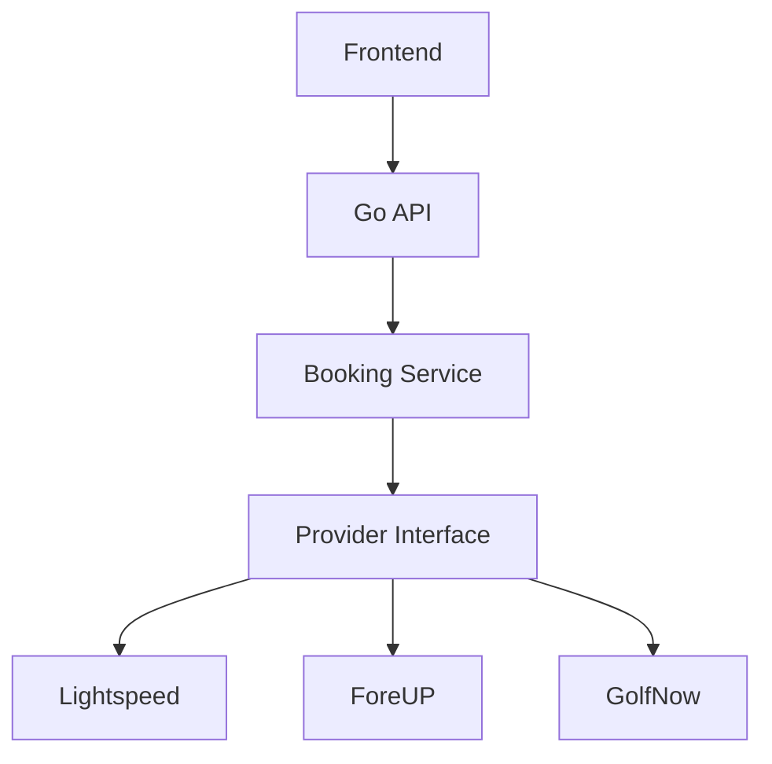
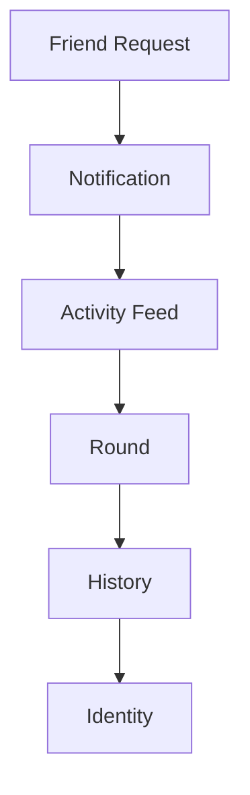

# FindFore — Architecture

**Last Updated:** August 07, 2026  
**Status:** Living document — system shape, boundaries, and diagrams.

> **Product direction:** [`VISION.md`](./VISION.md)  
> **Day-to-day engineering rules:** [`CLAUDE.md`](./CLAUDE.md)

---

## Guiding Principles

**Principle 1 — Optimize for deleting code.**  
The best feature is the one you never had to write.

**Principle 2 — Every external service gets an adapter.**  
Today that includes Lightspeed, Google Maps, Google Auth, Stripe, SendGrid, and push notifications. Tomorrow you can swap providers without rewriting business logic.

**Principle 3 — Business logic owns the truth.**  
Never let SQL, React, or external APIs make business decisions.

**Principle 4 — Everything is observable.**  
Every important action should answer: Who? What? When? How long? Did it succeed?

Apply Hexagonal Architecture at **system boundaries** (database, booking providers, notifications, payments, storage, maps, external APIs). Avoid unnecessary abstractions inside simple domain code.

---

## Booking Provider Stack

Booking is infrastructure behind a stable interface. The frontend and domain never talk to a tee-sheet vendor directly — they go through the Go API and a booking service that depends on a provider port.

```text
Frontend
   ↓
Go API
   ↓
Booking Service
   ↓
Provider Interface
   ↓
┌──────────┬──────────┬──────────┐
│Lightspeed│  ForeUP  │ GolfNow  │
└──────────┴──────────┴──────────┘
```



| Layer | Responsibility |
|---|---|
| Frontend | UX for discovery, invites, and booking flows — no vendor-specific logic |
| Go API | HTTP authz, request validation, response mapping |
| Booking Service | Domain rules for availability, holds, invites, and booking state |
| Provider Interface | Port that booking adapters implement |
| Lightspeed / ForeUP / GolfNow | Concrete adapters; swappable without changing the service |

---

## Social → Identity Loop

The retention path is not a booking checkout — it is a compounding loop from connection to permanent golf identity.

```text
Friend Request
   ↓
Notification
   ↓
Activity Feed
   ↓
Round
   ↓
History
   ↓
Identity
```



| Stage | Role |
|---|---|
| Friend Request | Starts a relationship; unlocks coordination |
| Notification | Pulls the user back when something social happens |
| Activity Feed | Surfaces community and “need one more” moments |
| Round | The shared experience (play + companion features) |
| History | Persists scores, photos, and who you played with |
| Identity | The durable golf profile that makes leaving costly |

---

## How to Use This Document

- **Adding a provider?** Implement the provider interface; do not branch vendor logic into the frontend or booking service.
- **Changing booking UX?** Stay above the Go API — provider details stay behind the adapter.
- **Building social features?** Trace them through this loop — connection → return visit → round → history → identity.
- **Drawing a new system?** Prefer a short mermaid diagram here; keep implementation detail in code and `CLAUDE.md`.
